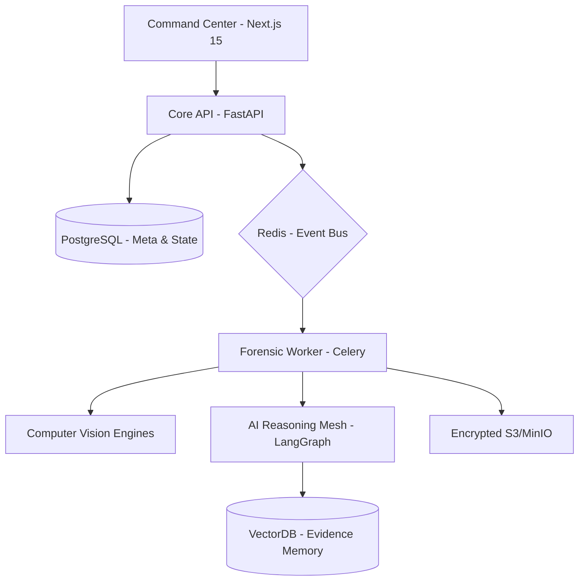

# ARES X: Autonomous Retrieval & Evidence Surveillance for Extended Digital Forensics


**ARES X** is a production-grade, enterprise-scale digital forensics and cyber intelligence platform designed for the next generation of investigations. Built for national intelligence agencies, enterprise SOC teams, and elite incident response units, ARES X synthesizes distributed systems engineering, computer vision research, and multi-agent AI to provide a comprehensive evidence surveillance ecosystem.

## 🛡️ Strategic Capabilities

### 1. Unified Case Management
*   **Orchestration**: Full lifecycle management of complex investigations.
*   **Auditability**: Immutable blockchain-inspired chain-of-custody ledger.
*   **Collaboration**: Real-time collaborative investigative workspaces.

### 2. Forensic Intelligence Mesh (AI Agents)
ARES X utilizes a multi-agent reasoning framework (LangGraph) to automate forensic analysis:
*   **Evidence Agent**: Technical artifact extraction and normalization.
*   **Deepfake Agent**: State-of-the-art synthetic media detection using Error Level Analysis (ELA) and GAN artifact analysis.
*   **Timeline Agent**: Autonomous reconstruction of event chronologies.
*   **Correlation Agent**: Mapping relationships between evidence, IOCs, and threat actors.

### 3. Media & Anomaly Detection
*   **ELA (Error Level Analysis)**: Visualizing JPEG compression inconsistencies.
*   **Frequency Domain Analysis**: Detecting high-frequency anomalies indicative of AI generation.
*   **Metadata Integrity**: Validating temporal and geographic consistency across media files.

### 4. Threat Intelligence & OSINT
*   **MITRE ATT&CK Mapping**: Automatic correlation of artifacts to known adversary tactics.
*   **Infrastructure Graphing**: Visual relationship mapping using Cytoscape.js and Neo4j.
*   **OSINT Enrichment**: Real-time enrichment from VirusTotal, Shodan, and GreyNoise.

## 🏗️ Architecture



## 🚀 Deployment

### Prerequisites
*   Docker & Docker Compose
*   Python 3.12+
*   Node.js 20+

### Quick Start
```bash
# Clone the repository
git clone https://github.com/Ananthapadmanabhan333/ARES-X.git
cd ARES-X

# Start the full stack
docker-compose up --build
```

The platform will be available at:
*   **Frontend (Command Center)**: `http://localhost:3000`
*   **Backend (Intelligence API)**: `http://localhost:8000`
*   **API Documentation**: `http://localhost:8000/docs`

## 🔐 Security Architecture

### Zero-Trust Principles
*   **Identity-First**: Every internal service request is validated via JWT.
*   **Least Privilege**: RBAC (Role-Based Access Control) enforced at the API gateway level.
*   **Evidence Isolation**: Media processing occurs in ephemeral, network-isolated sandboxes.

### Threat Model (STRIDE)
*   **Spoofing**: MFA-backed authentication and signed audit logs.
*   **Tampering**: Evidence integrity revalidation at every analysis stage (SHA256).
*   **Repudiation**: Immutable forensic ledger for all investigator actions.
*   **Information Disclosure**: AES-256 encryption at rest for all evidence storage.
*   **Denial of Service**: Rate-limiting and asynchronous task offloading via Redis/Celery.
*   **Elevation of Privilege**: Strict boundary isolation between AI agents and host system.

## 📊 Enterprise Roadmap
- [ ] **Q3 2024**: Volatility 3 integration for automated memory forensics.
- [ ] **Q4 2024**: Distributed PCAP analysis engine (Scapy + Zeek).
- [ ] **Q1 2025**: Fully autonomous evidence correlation (Auto-Pivot).

## ⚖️ License
Enterprise Proprietary / Intelligence Use Only.

---
*Built by Ananthapadmanabhan*
